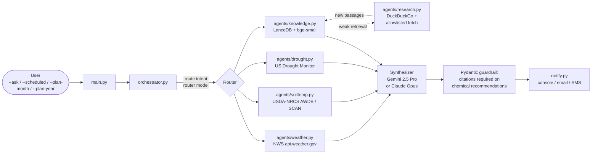

# lawn-agents

A multi-agent lawn-care advisory for **Zeon Zoysia** in coastal South Carolina.
It pulls live weather and soil temperature, retrieves cited passages from a
local knowledge base (Clemson HGIC, Super-Sod Lawn Academy, the Turfgrass
Group, your own paid guides), and recommends *when* to fertilize, treat for
grubs, apply pre-emergent, and put down micronutrients — with citations on
every chemical recommendation.

> **Safety rule.** This system never guesses on herbicide, fertilizer, or
> insecticide products. Every chemical recommendation must cite an
> authoritative passage from the retrieved knowledge base. If no source is
> found, it refuses and tells you where to look instead.

## Status

**Phase 1 is feature-complete.** Zeon Zoysia advisory ships ad-hoc Q&A
(`--ask`), weekly scheduled checks (`--scheduled`), monthly and annual
forward-planning (`--plan-month` / `--plan-year`), a never-guess
guardrail on every chemical recommendation (ADR 0003), a self-extending
RAG via an allowlisted research subagent (ADR 0005), and launchd-based
scheduling on macOS. Phase 2 will add live oaks, palms, hydrangeas, and
other shrubs.

## Architecture



Model provider is swappable behind a `ChatModel` Protocol (ADR 0006). Default
is Gemini 2.5 Flash (router) + Gemini 2.5 Pro (synthesizer) for cost; switch
to Claude Sonnet + Opus by editing one line in `config.yaml`.

External I/O is isolated to the `agents/*.py` modules. Each fails closed to
`None` so a flaky NWS endpoint can't kill the whole run — the synthesizer is
told what's missing and degrades gracefully ("soil temp unavailable today,
recommending based on 7-day air-temp trend").

For full module contracts and data flow, see [`docs/architecture.md`](docs/architecture.md).

## Quickstart

```bash
# 1. Install uv if you don't have it (https://docs.astral.sh/uv/)
curl -LsSf https://astral.sh/uv/install.sh | sh

# 2. Clone and sync
git clone https://github.com/mattlawck/lawn-agents
cd lawn-agents
uv sync --all-extras --dev

# 3. Configure
cp .env.example .env
# Edit .env and paste your GEMINI_API_KEY from aistudio.google.com
# (free-tier works). Or switch to Anthropic in config.yaml and use
# ANTHROPIC_API_KEY instead — see docs/adr/0006-provider-abstraction.md.

# 4. Copy the example config and edit for your location/cultivar/frost dates.
# Your config.yaml stays local (gitignored); the committed file is
# config.example.yaml.
cp config.example.yaml config.yaml

# 5. Bring your own corpus (see below) and ingest it
uv run python scripts/ingest_corpus.py

# 6. Ask away
uv run lawn-agents --ask "Is it too early to put down pre-emergent?"
uv run lawn-agents --scheduled
uv run lawn-agents --plan-year 2026
```

## Bring Your Own Corpus

The public repo deliberately ships **no** third-party content. Extension
publications, manufacturer guides, and paid PDFs you subscribe to remain on
your machine. The ingester (`scripts/ingest_corpus.py`) reads two sources:

1. **`data/corpus/*.pdf`** — drop any PDFs you've purchased or downloaded
   here. Gitignored.
2. **`seed_urls:` in `config.yaml`** — public pages we recommend pre-loading
   (Super-Sod Lawn Academy, NCSU TurfFiles, etc.). Fetched, chunked, and
   embedded into the local LanceDB index. The URL list is yours to edit.

Add a source any time — just append to `seed_urls` or drop a PDF into
`data/corpus/`, then re-run the ingester. Provenance metadata (source URL,
fetched-at timestamp, page number) is stored with every chunk so citations
are precise.

### When the corpus has a gap

If retrieval comes back weak on a question, the orchestrator can dispatch a
**research subagent** restricted to a domain allowlist (`config.yaml >
research.domain_allowlist`, defaults to `.edu`, `.gov`, and named
turf-industry sites). Found pages are chunked, embedded, and stored with
`requires_review: true` until you promote them via
`lawn-agents review-additions`. The RAG grows monotonically — your second
run is smarter than your first.

## Configuration

`config.yaml` holds non-secret settings: location, cultivar, frost dates,
soil-temp thresholds, knowledge/retrieval tuning, research allowlist, model
routing, notify sinks. Schema is defined in
[`src/lawn_agents/config.py`](src/lawn_agents/config.py) and validated by
Pydantic at startup.

`.env` holds secrets only — `GEMINI_API_KEY` by default, or
`ANTHROPIC_API_KEY` if you flip `models.provider` to `anthropic` in
`config.yaml`.

## Scheduling via launchd

The weekly check is meant to run unattended via macOS launchd. A
template plist lives at
[`scripts/launchd/com.mattlawck.lawnagents.plist`](scripts/launchd/com.mattlawck.lawnagents.plist).

```bash
# 1. Fill in your paths
export REPO=$(pwd)
mkdir -p ~/Library/Logs/lawn-agents
sed -e "s|/Users/YOUR_USER/Applications/lawn-agents|$REPO|g" \
    -e "s|/Users/YOUR_USER|$HOME|g" \
    scripts/launchd/com.mattlawck.lawnagents.plist \
  > ~/Library/LaunchAgents/com.mattlawck.lawnagents.plist

# 2. Bootstrap into the user session
launchctl bootstrap gui/$(id -u) ~/Library/LaunchAgents/com.mattlawck.lawnagents.plist
launchctl enable   gui/$(id -u)/com.mattlawck.lawnagents.scheduled

# 3. Optional — kick off a one-shot run right now
launchctl kickstart -k gui/$(id -u)/com.mattlawck.lawnagents.scheduled
```

Logs land in `~/Library/Logs/lawn-agents/{stdout,stderr}.log`. The job
retries on non-zero exit with a 10-minute throttle so a transient NWS
hiccup doesn't spiral.

Teardown when you're done:

```bash
launchctl bootout gui/$(id -u)/com.mattlawck.lawnagents.scheduled
rm ~/Library/LaunchAgents/com.mattlawck.lawnagents.plist
```

## Development

```bash
make dev      # install deps + activate pre-commit hooks
make check    # CI-parity verification: ruff + format + mypy --strict + pytest
```

`make check` is the canonical pre-push command — it mirrors what
`.github/workflows/ci.yml` runs. Coverage floor is 60% and currently
sits around 87%.

Individual targets are also available:

```bash
make lint           # ruff
make format         # auto-fix formatting
make format-check   # CI format check
make type           # mypy --strict
make test           # pytest with coverage
make help           # full target list
```

Or invoke tools directly via `uv` if you don't have `make`:

```bash
uv sync --all-extras --dev
uv run pre-commit install
uv run ruff check . && uv run ruff format --check .
uv run mypy
uv run pytest
```

CI runs the same checks on every push and PR — see
[`.github/workflows/ci.yml`](.github/workflows/ci.yml). The repo also
runs **CodeQL**, **SonarCloud**, and a vulnerable-dependency review on
every PR.

### Decision records

Non-obvious architectural choices are documented as ADRs in
[`docs/adr/`](docs/adr/). Engineering journal entries (the blog feedstock)
live in [`docs/journal/`](docs/journal/).

## Roadmap

- **Phase 1 (shipped)** — Zeon Zoysia: weather, soil temperature + moisture,
  drought, RAG with self-extending research, ad-hoc Q&A, weekly scheduled
  check, monthly and annual planning, never-guess guardrail, launchd
  scheduling.
- **Phase 2** — add subject modules for live oaks (young + mature), palms,
  hydrangeas, and other shrubs. Extend the router to pick the right
  subject from the question.
- **Phase 3** — additional notify sinks (email, SMS), photo-based disease
  triage, and a simple web UI.

## License

MIT — see [`LICENSE`](LICENSE).
