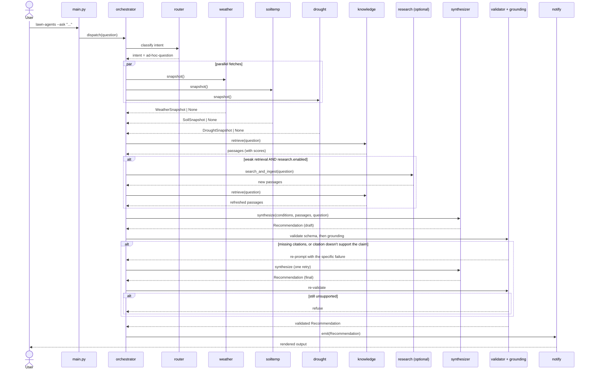

# Architecture

A standalone, locally-run advisory for a single landscape, designed so a
non-technical follow-up question and a regularly-scheduled weekly digest
share the same machinery. The whole pipeline is deterministic where it
can be (HTTP fetches, RAG retrieval, output validation) and uses LLMs at
only three points: intent routing, the relevance gate that fires on
ambiguous retrieval, and final synthesis.

Model IDs are config, not code (ADR 0006). The shipped default is
Gemini 2.5 Flash for both the router and the synthesizer; switching to
Claude Sonnet + Opus is a two-line change in `config.yaml`. Everything
below refers to roles ("router", "synthesizer"), not to specific models.

## Modules

| Module | Responsibility | Returns | LLM |
|---|---|---|---|
| `agents/weather.py` | NWS `api.weather.gov` client: gridpoint forecast, hourly, recent observations. | `WeatherSnapshot \| None` | — |
| `agents/soiltemp.py` | USDA-NRCS AWDB REST API: nearest SCAN station to the configured lat/lon; 2"/4" soil temperature. Falls back to a Parton/Logan model from NWS air-temp history when no station is within the configured radius. | `SoilSnapshot \| None` | — |
| `agents/drought.py` | US Drought Monitor REST: current D-level for the configured county FIPS + NOAA CPC 1/3-month outlooks. | `DroughtSnapshot \| None` | — |
| `agents/knowledge.py` | Local LanceDB index over the user's corpus + seed URLs. Vector retrieval, the tiered `is_weak` relevance check, source-tier classification (ADR 0009), and `<sources>` formatting. Returns chunks with full provenance for citation. | `list[Passage]` | embeddings only (bge-small via fastembed/ONNX) |
| `agents/research.py` | When retrieval is weak, web-search + allowlisted fetch, chunk, embed, store as `requires_review` passages. | `list[Passage]` (newly ingested) | — |
| `grounding.py` | Post-synthesis claim-support validation (ADR 0010): does each chemical item's citation actually *support* it? Provenance, snippet overlap, and chemical-term checks. Purely deterministic. | `list[GroundingError]` | — |
| `orchestrator.py` | Builds a `Conditions` snapshot, routes intent, calls knowledge (+ research if weak), invokes the synthesizer, validates schema **and** grounding. | `Recommendation` | router + relevance gate + synthesizer |
| `notify.py` | Renders `Recommendation` to one or more sinks. Phase 1: console; Phase 2: email/SMS. | side effect | — |
| `subjects/lawn.py` | Subject-specific knobs and prompts for the lawn (Zeon Zoysia). Implemented in Phase 1. | — | — |
| `subjects/tree.py`, `subjects/shrub.py` | Placeholders for Phase 2 subjects. Raise `NotImplementedError`. | — | — |
| `main.py` | Argparse CLI: `--scheduled`, `--ask "..."`, `--plan-month YYYY-MM`, `--plan-year YYYY`, `review-additions`. | exit code | — |

External I/O is isolated to the `agents/*.py` modules. Every fetcher must
fail closed to `None` (logged with reason) — never raise past its module
boundary. The synthesizer sees which inputs were available and degrades
gracefully when some are missing.

## Data flow

## The "never guess" guardrail

Four layers, and the history of how they got there is worth knowing —
each one exists because the previous set let something through.

1. **Prompt** — `prompts/synthesizer.md` and `prompts/planner.md` carry
   non-negotiable rules: any product name, application rate, or chemical
   timing must quote and cite a passage from the provided `<sources>`
   block. If no source supports the claim, refuse rather than estimate.
   This is the layer a model can silently ignore, which is why it is
   never the only one.

2. **Vocabulary bridges** — the user's words and the corpus's words
   differ. Extension publications discuss `chlorantraniliprole`; people
   ask about "GrubX". Labels say "annual lespedeza"; people say
   "Japanese clover". `data/chemicals.yaml` (ADR 0007) and
   `data/weeds.yaml` (ADR 0008) bridge both gaps, feeding *retrieval*,
   the relevance check, and the synthesizer prompt. Without them the
   guardrail refuses correct questions — a false refusal is a failure
   too.

3. **Schema** — synthesis output is a Pydantic `Recommendation` whose
   chemical-category items require at least one `Citation`
   (`_requires_citation_for_chemicals`). The orchestrator re-prompts
   once on failure, then refuses.

4. **Grounding** — `grounding.py` (ADR 0010) checks that each citation
   *supports* the claim rather than merely accompanying it: the cited
   `source_id` must have been in `<sources>`, the `snippet` must overlap
   the passage it quotes, and any chemical the action names must appear
   in a cited passage. Deterministic — no LLM, so the guardrail can't
   hallucinate while catching hallucination.

Layer 4 exists because layers 1–3 were not enough, and it is worth being
explicit about how they failed. On 2026-09-08 the system produced a
recommendation naming `foramsulfuron` as a Celsius active ingredient.
That word appears in **zero** corpus chunks. It carried a real,
correctly-attributed citation to the actual Celsius label. The schema
check passed, because a citation was present. Presence was never the
property that mattered.

**Known limitation.** Grounding does not catch every unsupported claim.
If a cited passage mentions both a weed and a chemistry in unrelated
contexts, recommending one for the other still passes. That failure is
a *retrieval* problem — the chunks that would have answered correctly
exist in the corpus and never reach the synthesizer — and it is tracked
as an open issue in [ADR 0010](adr/0010-claim-support-validation.md)
rather than papered over here.

**Source tiering** ([ADR 0009](adr/0009-source-trust-tiers.md)) is
adjacent but distinct: it does not decide whether a claim is supported,
it tells the synthesizer *how much weight* a supporting source deserves.
Extension guidance and a vendor's own product guide are both citable;
they are not equally authoritative, and the `tier=` marker in
`<sources>` makes that visible.

**Tests** — `tests/unit/test_grounding.py` covers each check against the
real failures that motivated it; `tests/integration/test_phase1_acceptance.py`
exercises the guardrail end-to-end through the orchestrator. Both run in
CI on every push, with no API calls.

## Configuration boundary

- `config.example.yaml` — the committed template. Location, cultivar,
  thresholds, retrieval and grounding knobs, source tiers, research
  allowlist, model IDs.
- `config.yaml` — the user's working copy, **gitignored**. Personal
  product choices and the seed URLs for labels they actually own belong
  here, not in the example (see ADR 0009's note on trust tiers).
- `.env` — secrets only. `GEMINI_API_KEY` by default, or
  `ANTHROPIC_API_KEY` when `models.provider` is `anthropic`. Gitignored.
- `data/chemicals.yaml`, `data/weeds.yaml` — the vocabulary bridges.
  Committed: brand → active-ingredient mapping is on every label, and
  weed synonyms are public taxonomy. No secrets, no licensed content.
- `data/corpus/` and `data/index/` — user's local content. Gitignored;
  the public repo ships no third-party publications.

`src/lawn_agents/config.py` is a Pydantic-Settings loader that merges the
two and validates at startup. A misconfigured run dies fast with a
clear error.

## Adding a new subject (Phase 2 preview)

When we extend beyond the lawn:

1. Add an entry to `subjects:` in `config.yaml` (the commented placeholder
   section shows the shape).
2. Implement `src/lawn_agents/subjects/<kind>.py` with a `Subject`
   Protocol (TBD) defining prompt fragments, relevant retrieval filters,
   and any subject-specific calendar offsets.
3. Update the router's intent classification so it can dispatch on
   subject as well as intent.
4. Add a seed-URL set and ingest cultivar/species-specific corpus.

Phase 1 deliberately does not pre-build the `Subject` Protocol — we'll
extract it from the lawn implementation once we have a concrete second
subject to design against.
