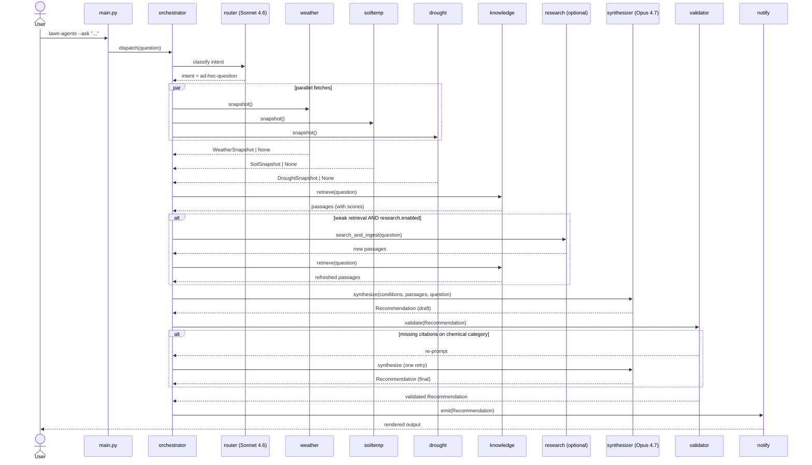

# Architecture

A standalone, locally-run advisory for a single landscape, designed so a
non-technical follow-up question and a regularly-scheduled weekly digest
share the same machinery. The whole pipeline is deterministic where it
can be (HTTP fetches, RAG retrieval) and uses LLMs only at two points:
intent routing (Sonnet 4.6) and final synthesis (Opus 4.7).

## Modules

| Module | Responsibility | Returns | LLM |
|---|---|---|---|
| `agents/weather.py` | NWS `api.weather.gov` client: gridpoint forecast, hourly, recent observations. | `WeatherSnapshot \| None` | — |
| `agents/soiltemp.py` | USDA-NRCS AWDB REST API: nearest SCAN station to the configured lat/lon; 2"/4" soil temperature. Falls back to a Parton/Logan model from NWS air-temp history when no station is within the configured radius. | `SoilSnapshot \| None` | — |
| `agents/drought.py` | US Drought Monitor REST: current D-level for the configured county FIPS + NOAA CPC 1/3-month outlooks. | `DroughtSnapshot \| None` | — |
| `agents/knowledge.py` | Local LanceDB index over the user's corpus + seed URLs. Hybrid retrieval (vector top-k + BM25) with optional reranker. Returns chunks with full provenance for citation. | `list[Passage]` | embeddings only (bge-small) |
| `agents/research.py` | When retrieval is weak, web-search + allowlisted fetch, chunk, embed, store as `requires_review` passages. | `list[Passage]` (newly ingested) | — |
| `orchestrator.py` | Builds a `Conditions` snapshot, routes intent, calls knowledge (+ research if weak), invokes the synthesizer, validates the result. | `Recommendation` | Sonnet 4.6 (router), Opus 4.7 (synth) |
| `notify.py` | Renders `Recommendation` to one or more sinks. Phase 1: console; Phase 2: email/SMS. | side effect | — |
| `subjects/lawn.py` | Subject-specific knobs and prompts for the lawn (Zeon Zoysia). Implemented in Phase 1. | — | — |
| `subjects/tree.py`, `subjects/shrub.py` | Placeholders for Phase 2 subjects. Raise `NotImplementedError`. | — | — |
| `main.py` | Argparse CLI: `--scheduled`, `--ask "..."`, `--plan-month YYYY-MM`, `--plan-year YYYY`, `review-additions`. | exit code | — |

External I/O is isolated to the `agents/*.py` modules. Every fetcher must
fail closed to `None` (logged with reason) — never raise past its module
boundary. The synthesizer sees which inputs were available and degrades
gracefully when some are missing.

## Data flow

## The "never guess" guardrail

Three layers of defense, by design (see [ADR 0003](adr/0003-never-guess-guardrail.md)):

1. **Prompt** — `prompts/synthesizer.md` includes a non-negotiable rule:
   any product name, application rate, or chemical timing must quote and
   cite a passage from the provided `<sources>` block. If no source
   supports the claim, the recommendation must say so explicitly and
   refuse rather than estimate.
2. **Schema** — synthesis output is a Pydantic `Recommendation` whose
   chemical-category items have `citations: list[Citation]` with
   `min_length=1`. A validator fails the output if the constraint is
   violated; the orchestrator re-prompts once, then surfaces a refusal.
3. **Tests** — `tests/test_guardrails.py` feeds the synthesizer empty
   `<sources>` and asserts the output refuses on every chemical category.
   This test runs in CI on every push.

## Configuration boundary

- `config.yaml` — non-secret, checked into the repo. Location, cultivar,
  thresholds, allowlists, model IDs.
- `.env` — secrets only. Currently `ANTHROPIC_API_KEY`. Gitignored.
- `data/corpus/` and `data/index/` — user's local content. Gitignored.

`src/lawn_agents/config.py` is a Pydantic-Settings loader that merges the
two and validates at startup. A misconfigured run dies fast with a
clear error.

## Adding a new subject (Phase 2 preview)

When we extend beyond the lawn:

1. Add an entry to `subjects:` in `config.yaml` (the commented placeholder
   section shows the shape).
2. Implement `src/lawn_agents/subjects/<kind>.py` with a `Subject`
   Protocol (TBD) defining prompt fragments, relevant retrieval filters,
   and any subject-specific calendar offsets.
3. Update the router's intent classification so it can dispatch on
   subject as well as intent.
4. Add a seed-URL set and ingest cultivar/species-specific corpus.

Phase 1 deliberately does not pre-build the `Subject` Protocol — we'll
extract it from the lawn implementation once we have a concrete second
subject to design against.
